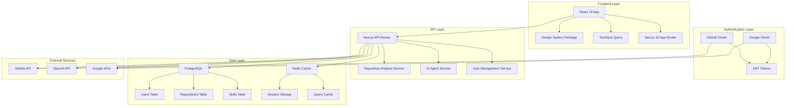

# Design Document

## Overview

The Skills Evaluation App is architected as a modern React 19 application using a monorepo structure with a custom design system. The application leverages server components, server actions, and optimistic updates to provide a seamless user experience. The system integrates with external APIs (Google OAuth, GitHub API, OpenAI) to gather comprehensive skill data and provide AI-powered insights.

## Architecture

### High-Level Architecture



### Monorepo Structure

The application follows a monorepo pattern with clear separation of concerns:

- **Design System Package**: Reusable UI components built on shadcn/ui and Radix UI
- **Main Application**: Next.js 15 app with App Router and React 19 features
- **Shared Storybook**: Documentation and testing for design system components

## Components and Interfaces

### Core Application Components

#### Authentication Components

- **GoogleLogin**: Handles OAuth flow initiation
- **AuthCallback**: Processes OAuth responses and token exchange
- **AuthProvider**: Context provider for authentication state management

#### Dashboard Components

- **SkillsMatrix**: Grid display of user skills with proficiency levels
- **ActivityFeed**: Timeline of recent coding activity and skill updates
- **MetricCards**: Key performance indicators and progress metrics

#### Repository Integration Components

- **RepoList**: Display connected repositories with analysis status
- **RepoAnalysis**: Detailed view of repository metrics and insights
- **CodeMetrics**: Visualization of code quality and contribution patterns

#### AI Agent Components

- **ChatInterface**: Conversational UI for AI interactions
- **Recommendations**: Display of personalized skill improvement suggestions
- **LearningPath**: Structured roadmap for skill development

### Design System Components

#### Layout Components

- **AppLayout**: Main application shell with header, sidebar, and content areas
- **Container**: Responsive content wrapper with size variants
- **Grid**: Flexible grid system for component arrangement

#### Data Display Components

- **SkillCard**: Individual skill representation with progress indicators
- **MetricCard**: Statistical display with trend visualization
- **ProgressChart**: Interactive charts for skill progression over time

#### Form Components

- **FormField**: Standardized form input wrapper with validation
- **SearchInput**: Advanced search with filtering and suggestions
- **SkillSelector**: Multi-select component for skill management

### API Interfaces

#### Authentication Service

```typescript
interface AuthService {
  googleLogin(): Promise<AuthResponse>;
  refreshToken(token: string): Promise<AuthResponse>;
  logout(): Promise<void>;
  getCurrentUser(): Promise<User>;
}
```

#### Repository Service

```typescript
interface RepositoryService {
  connectGitHub(): Promise<Repository[]>;
  analyzeRepository(repoId: string): Promise<AnalysisResult>;
  getRepositoryMetrics(repoId: string): Promise<Metrics>;
  syncRepositories(userId: string): Promise<void>;
}
```

#### Skills Service

```typescript
interface SkillsService {
  calculateSkills(userId: string): Promise<Skill[]>;
  updateSkillLevel(skillId: string, level: number): Promise<Skill>;
  getSkillProgression(userId: string): Promise<ProgressData>;
  generateSkillInsights(userId: string): Promise<Insight[]>;
}
```

#### AI Service

```typescript
interface AIService {
  chatCompletion(messages: Message[]): Promise<AIResponse>;
  generateRecommendations(userProfile: UserProfile): Promise<Recommendation[]>;
  createLearningPath(skills: Skill[], goals: Goal[]): Promise<LearningPath>;
}
```

## Data Models

### User Model

```typescript
interface User {
  id: string;
  googleId: string;
  email: string;
  name: string;
  profileData: {
    experienceLevel: "beginner" | "intermediate" | "advanced" | "expert";
    goals: string[];
    preferences: UserPreferences;
  };
  createdAt: Date;
  updatedAt: Date;
}
```

### Repository Model

```typescript
interface Repository {
  id: string;
  userId: string;
  provider: "github" | "gitlab";
  repoId: string;
  name: string;
  url: string;
  analysisData: {
    languages: LanguageStats[];
    commitFrequency: CommitStats;
    codeQuality: QualityMetrics;
    collaborationMetrics: CollaborationStats;
  };
  lastAnalyzed: Date;
  createdAt: Date;
}
```

### Skill Model

```typescript
interface Skill {
  id: string;
  userId: string;
  category: "programming_language" | "framework" | "tool" | "soft_skill";
  skillName: string;
  proficiencyLevel: number; // 1-10 scale
  evidence: {
    repositoryUsage: RepositoryEvidence[];
    projectCount: number;
    lastUsed: Date;
    improvementRate: number;
  };
  lastUpdated: Date;
  createdAt: Date;
}
```

### AI Interaction Model

```typescript
interface AIInteraction {
  id: string;
  userId: string;
  interactionType: "chat" | "recommendation" | "learning_path";
  inputData: any;
  responseData: any;
  createdAt: Date;
}
```

## Error Handling

### Client-Side Error Handling

- **Error Boundaries**: React error boundaries for component-level error isolation
- **Query Error States**: TanStack Query error handling with retry logic
- **Form Validation**: Real-time validation with clear error messaging
- **Network Error Recovery**: Automatic retry with exponential backoff

### Server-Side Error Handling

- **API Error Responses**: Standardized error format with error codes
- **Authentication Errors**: Proper handling of token expiration and refresh
- **Rate Limiting**: Graceful degradation when API limits are reached
- **External Service Failures**: Fallback mechanisms for third-party API failures

### Error Monitoring

- **Sentry Integration**: Comprehensive error tracking and alerting
- **Performance Monitoring**: Real-time performance metrics and bottleneck identification
- **User Experience Tracking**: Error impact on user workflows

## Testing Strategy

### Unit Testing

- **Component Testing**: React Testing Library for component behavior
- **Hook Testing**: Custom hook testing with proper mocking
- **Utility Function Testing**: Pure function testing with edge cases
- **API Service Testing**: Mock-based testing for service layer

### Integration Testing

- **API Integration**: End-to-end API workflow testing
- **Authentication Flow**: Complete OAuth flow testing
- **Repository Analysis**: Integration with GitHub API testing
- **AI Service Integration**: Mock-based AI service testing

### End-to-End Testing

- **User Journey Testing**: Critical path testing with Playwright
- **Cross-Browser Testing**: Compatibility across major browsers
- **Mobile Responsiveness**: Touch interaction and responsive design testing
- **Performance Testing**: Load time and interaction performance validation

### Design System Testing

- **Visual Regression Testing**: Automated screenshot comparison
- **Accessibility Testing**: WCAG compliance validation
- **Component API Testing**: Props and behavior validation
- **Storybook Testing**: Interactive component documentation and testing

## Performance Considerations

### Frontend Optimization

- **React 19 Features**: Server components for reduced client-side JavaScript
- **Code Splitting**: Route-based and component-based lazy loading
- **Image Optimization**: Next.js Image component with automatic optimization
- **Bundle Analysis**: Regular bundle size monitoring and optimization

### Data Fetching Optimization

- **TanStack Query**: Intelligent caching and background updates
- **Server Actions**: Direct server mutations without API roundtrips
- **Optimistic Updates**: Immediate UI updates with rollback capability
- **Prefetching**: Strategic data prefetching for improved perceived performance

### Caching Strategy

- **Redis Caching**: Frequently accessed data caching
- **CDN Integration**: Static asset delivery optimization
- **Browser Caching**: Appropriate cache headers for different resource types
- **Query Caching**: Intelligent query result caching with invalidation

## Security Implementation

### Authentication Security

- **OAuth 2.0**: Secure third-party authentication
- **JWT Tokens**: Stateless authentication with proper expiration
- **Token Refresh**: Automatic token renewal without user intervention
- **Session Management**: Secure session handling with Redis

### Data Protection

- **Encryption at Rest**: Database encryption for sensitive data
- **Encryption in Transit**: HTTPS for all communications
- **API Security**: Rate limiting and request validation
- **Input Sanitization**: Protection against injection attacks

### Privacy Controls

- **Data Consent**: Clear opt-in mechanisms for data collection
- **Data Export**: User-controlled data export functionality
- **Data Deletion**: Complete data removal on user request
- **Repository Privacy**: Respect for private repository settings

## Deployment Architecture

### Infrastructure

- **Vercel Deployment**: Serverless deployment with automatic scaling
- **Database Hosting**: Managed PostgreSQL with automated backups
- **Redis Hosting**: Managed Redis for caching and sessions
- **CDN Integration**: Global content delivery for optimal performance

### CI/CD Pipeline

- **GitHub Actions**: Automated testing and deployment
- **Quality Gates**: Code quality checks and test coverage requirements
- **Environment Management**: Separate staging and production environments
- **Rollback Strategy**: Quick rollback capability for failed deployments

### Monitoring and Observability

- **Application Monitoring**: Real-time performance and error tracking
- **Infrastructure Monitoring**: Server and database performance metrics
- **User Analytics**: Privacy-compliant usage analytics
- **Alerting System**: Proactive alerting for critical issues
